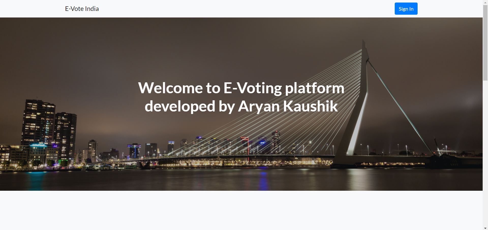

# E-Vote 

E-Vote is an online voting site that I made as a final project for CS50x course provided by Harvard University's division of continuing education and it hopes to improve the voting procedures used currently.

The site saves data to a local SQL database file.

No user is linked to his or her vote so you can have peace of mind that no one can know who voted for who only you know that.

The website requires both voter and candidate registrations but they are just to keep a check that whether you are a real voter or not.

My voting system is currently based on plurality.

## What are the benefits of electronic voting 

electronic voting hopes to improve the voting procedures used currently as electronic voting is cost-efficient as you don't have to go to different places and deploy those bulky voting machines and bring them back to the voting authority which costs a lot because you also have to set up booths and transportation charges are also pretty high not only that but electronic voting is also faster as you just have to go to the site and vote you don't have to wait in a queue for your chance nor you have to go out and find your voting booth. electronic voting could also attract more voters than traditional methods as sometimes during traditional elections some people don't get a chance to vote because of there current situation like if they had to immediately travel or their location doesn't allow it or they were too lazy to go to the voting booth all those problems can be effectively solved by electronic voting.

## Preview


## Getting Started

These instructions will get you a copy of the project up and running on your local machine for development and testing purposes.

### Prerequisites

You will need to install the following programs and libraries to run the website on your local machine.

```
Python
Flask
Flask_session
javascript
```

To install requirements use command -
`pip install -r requirements.txt`

Website folder already contains files required to run javascript.

### Installing

A step by step series of examples that tell you how to get a development env running

Open the directory where you have saved this site 

Now do `SHIFT + Right Click` and then select either powershell or command prompt according to your convinience

Now in the terminal window of your choice type -

```
flask run
```

And hit enter

now you will see a bunch of text along with a IP address on your terminal window copy it and paste it onto your browser url box


Typically it is -

```
127.0.0.1:5000/
```

After this you will see a webpage opening.

### Using The site

The home page of website is located at
```
127.0.0.1:5000/
```
On the website click sign In to login there you will have options to register as a candidate or as a normal voter

after you have successfully registered and logged in you will be redirected to - 
```
127.0.0.1:5000/vote
```

Once you have voted you will not be able to vote again until your vote status is reset before the next election. 

Once voted you will be redirected to - 
```
127.0.0.1:5000/main
```
Where you will be able to access the current status of election.


## Built With

* [Flask]() - The web framework used
* [Python](https://www.python.org/) - As Controller
* [Bootstrap](https://getbootstrap.com/) - Used to design the page
* [Javascript]() - To make website responsive
* [HTML and CSS]() - As backbone


## Authors

* **Aryan Kaushik** - *Developer and Creator* - [Aryan20](https://github.com/Aryan20)


## Acknowledgments

* CS50x course for knowledge of flask
